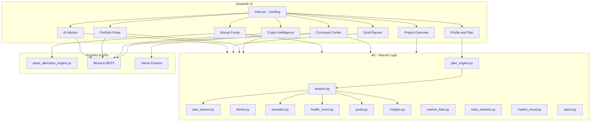
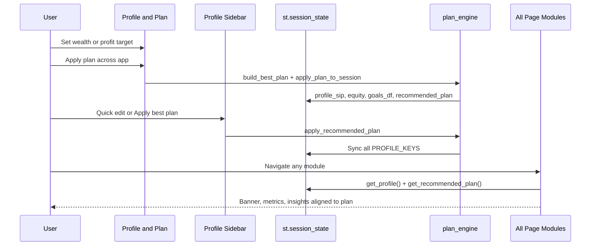

# Finance Analytics Hub — Complete Project Documentation

**Final Year Project (B.Tech Computer Science) · Academic Year 2025–26**

| Field | Value |
|-------|-------|
| **Title** | Finance Analytics Hub |
| **Subtitle** | An Intelligent Web-Based Platform for Personal Investment Planning & Portfolio Analytics |
| **Student** | Shail (`CS-FYP-2026-001`) |
| **Department** | Computer Science & Engineering |
| **Institution** | [Your University Name] |
| **Guide** | Dr. [Guide Name] |

---

## Table of Contents

1. [Overview](#overview)
2. [Problem Statement & Objectives](#problem-statement--objectives)
3. [Profile & Best Plan (Central Feature)](#profile--best-plan-central-feature)
4. [System Architecture](#system-architecture)
5. [Technology Stack](#technology-stack)
6. [Installation & Running](#installation--running)
7. [Project Structure](#project-structure)
8. [Application Modules](#application-modules)
9. [Shared Library (`lib/`)](#shared-library-lib)
10. [External Data Sources](#external-data-sources)
11. [Core Algorithms](#core-algorithms)
12. [Session State & Data Flow](#session-state--data-flow)
13. [Demo Mode & Viva Presentation](#demo-mode--viva-presentation)
14. [Bundled Subprojects](#bundled-subprojects)
15. [Configuration Files](#configuration-files)
16. [Future Scope](#future-scope)
17. [Disclaimer](#disclaimer)

---

## Overview

**Finance Analytics Hub** is a unified Streamlit web application built as a final-year capstone project. It helps retail investors in India plan mutual fund allocations, monitor cryptocurrency markets, set multi-goal SIP targets, and assess overall financial health — all from a single dashboard with live market feeds and quantitative engines.

The app is built around a **global financial profile** and a **Best Plan engine**: you set a **wealth corpus target** or **annual profit target**, and the system calculates the optimal SIP, equity split, MF/crypto/liquid allocation, and risk strategy — then **syncs those values across every module**.

Key differentiators:

- **Target-driven** — Wealth or profit goals drive SIP, allocation, and goal planning app-wide.
- **Unified** — Mutual funds, crypto, goals, and health scoring in one app (not separate spreadsheets or tools).
- **Data-driven** — Live data from Binance (crypto) and Yahoo Finance (Nifty 50, Sensex).
- **Quantitative** — Monte Carlo wealth simulation with percentile bands (500+ paths).
- **Explainable** — Rule-based “AI advisor” with prioritized, actionable insights (not a black-box LLM).
- **Production-style** — Modular `lib/` package, shared session profile, HTML report exports.

**Entry point:** `main.py` (landing page)  
**Run command:** `streamlit run main.py`  
**Default URL:** http://localhost:8501

**Recommended first step:** Open **Profile & Plan** → set your target → click **Apply this plan across the entire app**.

---

## Problem Statement & Objectives

### Problem Statement

Retail investors in India manage **mutual funds**, **crypto exposure**, and **multiple life goals** (house, education, retirement) using disconnected tools. Most apps focus on trading or generic calculators rather than integrated, visual, quantitative planning with live markets and explainable recommendations. Changing one input (e.g. a profit goal) rarely updates SIP, allocation, and goals together.

### Project Objectives

| # | Objective |
|---|-----------|
| O1 | Design a unified platform integrating mutual fund allocation and cryptocurrency analytics. |
| O2 | Implement rule-based and Monte Carlo models for wealth projection and goal planning. |
| O3 | Develop a financial health scoring system across five readiness pillars. |
| O4 | Integrate live market data (Binance API, Indian indices) without proprietary API keys. |
| O5 | Provide exportable reports suitable for personal financial review. |
| O6 | *(Extended)* Link profile targets (wealth/profit) to a single **best plan** synced across all modules. |

### Methodology (high level)

1. **Requirements** — Investor needs survey (allocation, goals, crypto, target wealth/profit).
2. **Design** — Modular Streamlit multi-page app with shared session state and plan engine.
3. **Implementation** — Python engines for allocation, simulation, health scoring, plan recommendation.
4. **Integration** — Public REST APIs for crypto and Indian indices.
5. **Validation** — Demo profiles, plan apply flow, and edge-case scenario testing.

Metadata (student name, institution, guide) is centralized in `lib/project_meta.py` for easy edits before submission.

---

## Profile & Best Plan (Central Feature)

This is the **main user workflow** that ties the project together.

### What the user sets

| Input | Description |
|-------|-------------|
| **Target mode** | `wealth` — target corpus (₹) · `profit` — target annual profit from investments (₹) |
| **Horizon** | Years to reach the target (`profile_target_years`) |
| **Risk tolerance** | `auto`, `conservative`, `moderate`, or `aggressive` |
| **Expected return %** | Planning assumption for SIP math and Monte Carlo (`profile_expected_return`) |
| **Financial profile** | Age, income, current SIP, equity %, MF/crypto holdings, emergency fund, insurance |

### What the engine produces (`RecommendedPlan`)

| Output | Meaning |
|--------|---------|
| `required_monthly_sip` | SIP needed to hit target from current wealth |
| `recommended_sip` | Affordable SIP (capped by income & emergency-fund rules) |
| `equity_pct` | Age- and risk-based equity allocation |
| `risk_profile` | MF planner risk: conservative / moderate / aggressive |
| `equity_strategy` | e.g. `balanced_growth`, `index_core` |
| `mf_sip` / `crypto_sip` / `liquid_sip` | Monthly SIP split across buckets |
| `success_probability` | Monte Carlo % of paths reaching target corpus |
| `plan_grade` | A / B / C readiness vs target |
| `actions` | Prioritized checklist for the user |

### Apply plan — what syncs app-wide

When the user clicks **Apply this plan across the entire app** (`apply_plan_to_session`):

1. **`profile_sip`** and **`profile_equity`** updated to recommended values.
2. **`profile_mf_risk`** and **`profile_equity_strategy`** set for Mutual Fund module hints.
3. **`recommended_plan`** dict stored in session; **`plan_applied`** flag set.
4. **Goal Planner** — first row in `goals_df` set to wealth target, years, saved amount, recommended SIP.
5. **`goals_gap_total`** updated for AI Advisor insights.
6. **All pages** show an active-plan banner via `lib/plan_banner.py`.

### Where to configure

| Location | Use |
|----------|-----|
| **`pages/7_⚙️_Profile_and_Plan.py`** | Full UI: targets, profile, charts, apply button |
| **Sidebar** (every page) | Quick target, **Apply best plan**, link to full page |
| **Home** | Button: **Set target & best plan** |

### Profit mode math

Annual profit target is converted to an implied corpus:

`wealth_target ≈ annual_profit / expected_return_rate`

Then the same SIP and allocation logic runs as in wealth mode.

---

## System Architecture



**Layers:**

| Layer | Role |
|-------|------|
| **Presentation** | Streamlit pages under `pages/` + `main.py` |
| **Profile & planning** | `plan_engine.py` + `session.py` — targets → best plan → sync |
| **Business logic** | `lib/` — reusable functions, no UI coupling |
| **Domain engines** | Mutual fund allocation engine (embedded package) |
| **Data** | Binance public API, Yahoo Finance chart endpoints |

---

## Technology Stack

| Technology | Purpose |
|------------|---------|
| **Python 3.11** | Core language |
| **Streamlit** | Multi-page web UI and session state |
| **Plotly** | Interactive charts (candlesticks, donuts, Monte Carlo bands) |
| **Pandas** | Market tables, goal dataframes |
| **NumPy** | Monte Carlo path generation |
| **Requests** | HTTP calls to Binance and Yahoo |
| **Binance API** | Crypto 24h tickers, OHLCV klines (no API key) |
| **Yahoo Finance** | Nifty 50 & Sensex index prices |

**Dependencies** (`requirements.txt`):

```
streamlit>=1.28.0
pandas>=2.0.0
plotly>=5.17.0
requests>=2.31.0
numpy>=1.24.0
```

---

## Installation & Running

### Prerequisites

- Python 3.11+ (recommended)
- Internet access for live market modules (MF planner works offline)

### Local setup

```bash
cd c:\Users\shail\Downloads\main_project\main_project
pip install -r requirements.txt
streamlit run main.py
```

Open **http://localhost:8501** in your browser.

### First-time workflow

1. Open **Profile & Plan** (sidebar or home button).
2. Set **target corpus** or **target annual profit** and years.
3. Click **Apply this plan across the entire app**.
4. Explore Command Center, Goal Planner, AI Advisor — values stay in sync.

### GitHub Codespaces / Dev Container

The repo includes `.devcontainer/devcontainer.json` (Python 3.11 image). On attach, it runs:

`streamlit run main.py --server.enableCORS false --server.enableXsrfProtection false`

Port **8501** is forwarded automatically.

### Streamlit theme

UI styling is defined in `.streamlit/config.toml` and augmented by `lib/theme.py` (custom CSS, glass cards, hero animations).

---

## Project Structure

```
main_project/
├── main.py                          # Landing page & module showcase
├── requirements.txt                 # Python dependencies
├── README.md                        # Short project readme
├── PROJECT_DOCUMENTATION.md         # This file — full project guide
├── VIVA_DEMO_SCRIPT.md              # 5-minute presentation script
│
├── pages/                           # Streamlit multi-page routes
│   ├── 0_🎓_Project_Overview.py     # FYP docs, architecture, objectives
│   ├── 1_🏠_Command_Center.py       # India indices, mood, Monte Carlo
│   ├── 2_📈_Mutual_Funds.py         # Embeds MF allocation planner
│   ├── 3_₿_Crypto_Intelligence.py   # Charts, movers, watchlist
│   ├── 4_💓_Portfolio_Pulse.py      # Unified snapshot + HTML export
│   ├── 5_🎯_Goal_Planner.py         # Multi-goal SIP + success probability
│   ├── 6_🧠_AI_Advisor.py           # Health score + prioritized insights
│   └── 7_⚙️_Profile_and_Plan.py     # Targets, best plan, apply app-wide
│
├── lib/                             # Shared application logic
│   ├── __init__.py
│   ├── project_meta.py              # Title, student, objectives, modules list
│   ├── session.py                   # Global profile + apply_recommended_plan()
│   ├── plan_engine.py               # build_best_plan, apply_plan_to_session
│   ├── plan_banner.py               # Active-plan banner on synced pages
│   ├── theme.py                     # CSS injection & sidebar branding
│   ├── capstone.py                  # Footer, demo banner, tech badges
│   ├── demo_data.py                 # Demo profile + auto-apply plan
│   ├── market_data.py               # Binance tickers & klines
│   ├── india_markets.py             # Nifty / Sensex via Yahoo
│   ├── market_mood.py               # Crypto fear/greed-style gauge
│   ├── simulator.py                 # Monte Carlo & goal probability
│   ├── health_score.py              # 5-pillar financial health (0–100)
│   ├── goals.py                     # Per-goal SIP & asset horizon logic
│   ├── insights.py                  # Rule-based advisor (+ best plan insights)
│   └── report.py                    # HTML report builder
│
├── MutualFunds-Allocation-Planner-main/
│   └── MutualFunds-Allocation-Planner-main/
│       ├── asset_allocation_engine.py   # Core MF allocation logic
│       ├── streamlit_app.py             # Original MF Streamlit UI
│       ├── requirements.txt
│       └── README.md
│
├── example-app-crypto-dashboard-main/   # Reference crypto dashboard (upstream)
│   ├── app.py
│   ├── requirements.txt
│   └── README.md
│
├── .streamlit/
│   └── config.toml                      # Streamlit theme colors
│
└── .devcontainer/
    └── devcontainer.json                # Codespaces / VS Code dev container
```

---

## Application Modules

The platform has **8 integrated modules** (including Profile & Plan).

### Home — `main.py`

- Hero section with project title, student, institution (from `PROJECT` dict).
- **Start demo walkthrough** — loads demo profile and auto-applies best plan.
- **Set target & best plan** — navigates to Profile & Plan page.
- **Open AI Advisor** — quick link to insights.
- Stats row (8 modules, live data, 500+ MC sims, 5 health pillars).
- Module showcase cards from `MODULES` in `project_meta.py`.
- Info banner: start with Profile & Plan, then apply plan everywhere.

### 0. Project Overview — `pages/0_🎓_Project_Overview.py`

Viva-ready documentation inside the app:

- Student info card (name, roll, department, guide).
- Tabs: Abstract, Architecture, Tech Stack, Future Scope.
- Problem statement, objectives, methodology.
- **Load demo profile** button for presentations (includes plan apply).

### 1. Profile & Plan — `pages/7_⚙️_Profile_and_Plan.py`

**Central configuration hub** for the whole application:

- Target mode: **corpus (₹)** or **annual profit (₹)**.
- Horizon, risk tolerance, expected return %.
- Full financial profile (age, income, SIP, holdings, safety flags).
- Live **recommended best plan** preview (SIP, split, grade, actions).
- Charts: SIP allocation pie, median path vs target line.
- **Apply this plan across the entire app** — one-click sync.
- Health score preview using recommended SIP.

### 2. Command Center — `pages/1_🏠_Command_Center.py`

Central market and simulation hub:

- **Active plan banner** when a plan is applied or previewed.
- **Indian Markets** — Nifty 50 & Sensex live metrics (`fetch_india_indices`).
- **Crypto watchlist** — 24h snapshot from Binance (`watchlist_snapshot`).
- **Market mood** — aggregate sentiment gauge from ticker data (`compute_market_mood`).
- **Financial health score** — from sidebar profile (`compute_health_score`).
- **Monte Carlo engine** — default years from plan target; SIP from profile.

### 3. Mutual Fund Planner — `pages/2_📈_Mutual_Funds.py`

Embeds the standalone **Mutual Funds Allocation Planner** by adding its folder to `sys.path` and calling `streamlit_app.main()`:

- **Plan banner** + info box with recommended age, SIP, risk, equity %, strategy (after apply).
- Risk profile (conservative / moderate / aggressive).
- Age-based equity–debt split.
- Equity strategy (index core, market weighted, balanced, aggressive growth).
- SIP breakdown, fund category recommendations, rebalancing triggers.
- Retirement projection charts and JSON plan download.

Core logic lives in `asset_allocation_engine.py` (~900 lines, dataclasses for `UserProfile`, `FinancialGoal`, allocation plans).

### 4. Crypto Intelligence — `pages/3_₿_Crypto_Intelligence.py`

- Live **Binance** 24h tickers (cached 60s).
- Interactive **OHLCV** candlestick charts (`fetch_klines`).
- Top gainers / losers (`top_movers`).
- Paper portfolio / watchlist tied to profile crypto USD value.
- Manual refresh clears cache.
- Crypto SIP slice from applied plan informs satellite allocation context.

### 5. Portfolio Pulse — `pages/4_💓_Portfolio_Pulse.py`

Unified dashboard reading the **global sidebar profile**:

- **Active plan banner**.
- **Target vs current** — wealth target, median corpus at horizon, plan SIP grade.
- Asset mix visualization (MF vs crypto in INR).
- Health score breakdown.
- Market mood summary.
- **Download HTML report** (`build_html_report`) — includes target fields.

### 6. Goal Planner — `pages/5_🎯_Goal_Planner.py`

- **Active plan banner**; primary goal synced from profile on apply.
- Editable goals table (target, years, priority, saved amount, your SIP).
- Default first row uses `profile_wealth_target` and recommended SIP when plan applied.
- **Required SIP** per goal (`monthly_sip_for_goal`, `plan_goal`).
- Recommended asset class by horizon (`asset_for_horizon`).
- **Success probability** via Monte Carlo (`probability_of_reaching_goal`).
- Timeline charts (Plotly); `goals_gap_total` feeds AI Advisor.

### 7. AI Advisor — `pages/6_🧠_AI_Advisor.py`

Rule-based “intelligent” guidance (not an external LLM):

- **Active plan banner** and **best plan** metrics card.
- **Apply this plan everywhere** if not yet applied.
- Health score grade and pillar breakdown.
- Live crypto mood context.
- **Prioritized insights** — **Best Plan** and **Target** categories first (`generate_advisor_insights`).
- Mini Monte Carlo preview.
- **HTML report download** for viva demos.

---

## Shared Library (`lib/`)

| Module | Responsibility |
|--------|----------------|
| `project_meta.py` | `PROJECT`, `OBJECTIVES`, `TECH_STACK`, `MODULES` constants |
| `session.py` | `init_profile`, `get_profile`, `render_profile_sidebar`, `apply_recommended_plan`, plan summary in sidebar |
| `plan_engine.py` | `build_best_plan`, `apply_plan_to_session`, `get_recommended_plan`, `RecommendedPlan` dataclass |
| `plan_banner.py` | `render_active_plan_banner()` — shared UI strip on synced pages |
| `theme.py` | Dark fintech theme CSS, sidebar brand, `inject_theme()` |
| `capstone.py` | Footer, demo mode banner, technology badge row |
| `demo_data.py` | `DEMO_PROFILE` + `load_demo_into_session()` (auto-applies plan) |
| `market_data.py` | Binance ticker/klines, watchlist, formatters, `CRYPTO_OPTIONS` |
| `india_markets.py` | Yahoo chart API for Nifty/Sensex, INR formatting |
| `market_mood.py` | Score 0–100 from % of assets up in 24h |
| `simulator.py` | `run_monte_carlo`, `probability_of_reaching_goal` |
| `health_score.py` | `HealthResult` dataclass, 5×20 point pillars |
| `goals.py` | `GoalPlan`, SIP math, horizon-based asset labels |
| `insights.py` | `generate_advisor_insights` — includes best-plan and target-gap rules |
| `report.py` | `build_html_report` — profile targets + recommendations |

### Profile keys (session state)

| Key | Description |
|-----|-------------|
| `profile_age` | Investor age (18–75) |
| `profile_income` | Monthly income (₹) |
| `profile_sip` | Monthly SIP (₹) — updated on plan apply |
| `profile_equity` | Target equity % — updated on plan apply |
| `profile_mf_value` | Current mutual fund holdings (₹) |
| `profile_crypto_usd` | Crypto holdings (USD) |
| `profile_usd_inr` | USD→INR rate |
| `profile_emergency_fund` | Boolean — 6-month fund built |
| `profile_insurance` | Boolean — adequate cover |
| `profile_wealth_target` | Target corpus (₹) |
| `profile_profit_target` | Target annual profit from investments (₹) |
| `profile_target_years` | Years to reach target |
| `profile_target_mode` | `wealth` or `profit` |
| `profile_risk` | `auto`, `conservative`, `moderate`, `aggressive` |
| `profile_expected_return` | Planning return % (default 12) |
| `profile_mf_risk` | MF planner risk after apply |
| `profile_equity_strategy` | MF equity strategy after apply |

### Plan-related session keys

| Key | Description |
|-----|-------------|
| `recommended_plan` | Dict snapshot of last `RecommendedPlan` |
| `plan_applied` | `True` after user applies plan app-wide |
| `goals_df` | Goal Planner table; row 0 synced on apply |
| `goals_gap_total` | Monthly SIP shortfall across goals (for advisor) |
| `demo_loaded` | Set when demo profile is loaded |

---

## External Data Sources

### Binance (crypto)

| Endpoint | Usage |
|----------|--------|
| `GET /api/v3/ticker/24hr` | All symbols 24h change — mood, watchlist, movers |
| `GET /api/v3/klines` | OHLCV candles for chart module |

No API key required. Rate limits apply; UI caches data (~60s TTL).

### Yahoo Finance (India indices)

`lib/india_markets.py` fetches chart data for encoded symbols (Nifty 50, Sensex). Requires network; Command Center shows graceful fallback if unavailable.

---

## Core Algorithms

### Best plan engine (`lib/plan_engine.py`)

1. **Resolve target corpus** — direct wealth target, or `profit / expected_return` in profit mode.
2. **Required SIP** — `monthly_sip_for_goal(target, years, return%, current_wealth)`.
3. **Affordable SIP** — cap at ~45% of income (lower if no emergency fund).
4. **Equity %** — from age + risk (`auto` uses `100 - age` baseline).
5. **SIP split** — MF / crypto / liquid percentages (higher liquid if no emergency fund).
6. **Success probability** — 500-path Monte Carlo vs target corpus.
7. **Grade** — A (on track), B (minor adjust), C (needs more funding).
8. **Apply** — writes profile + goals + session flags.

### Monte Carlo wealth simulation (`lib/simulator.py`)

- Models monthly SIP + initial lump sum over `years × 12` months.
- Monthly returns: normal distribution with `mu = mean_return/12`, `sigma = volatility/√12`.
- Default: **500 simulations**, seed 42 for reproducibility.
- Outputs: 10th / 50th / 90th percentile paths, final wealth distribution, total invested.
- Used by Command Center, AI Advisor, Profile & Plan, and plan success %.

### Goal success probability

Uses the same return/volatility assumptions to estimate probability of reaching a target corpus by the goal year (used in Goal Planner).

### Financial health score (`lib/health_score.py`)

Five pillars, **20 points each** (max 100):

1. Emergency fund  
2. Insurance  
3. Savings rate (SIP / income)  
4. Age-appropriate equity allocation  
5. Diversification (MF + crypto balance)

Returns `HealthResult`: score, letter grade, color, breakdown dict, insight strings.

### Mutual fund allocation (`asset_allocation_engine.py`)

- Maps age → risk profile and equity–debt ratio.
- Sub-allocates equity across large/mid/small cap per `EquityStrategy`.
- Debt split across liquid, short-duration, corporate bond categories.
- Goal-aware adjustments via `FinancialGoal` timeframes (short / medium / long term).
- Generates SIP amounts, rebalancing bands, and narrative recommendations.
- **Aligned with profile plan** via sidebar hints (risk, equity %, strategy) after apply.

### Advisor insights (`lib/insights.py`)

Deterministic rules, e.g.:

- **Best plan summary** — priority 0 when target is set.
- **Target gap** — SIP shortfall vs required for wealth/profit goal.
- No emergency fund → highest priority safety action.
- No insurance → protection gap.
- Equity % far from age baseline → rebalance suggestion.
- Goals SIP gap → funding recommendation.
- Extreme market mood → caution or opportunity framing.
- Crypto concentration → rebalance into MF core.

---

## Session State & Data Flow



- **Demo flag:** `demo_loaded` set when demo profile is injected; plan auto-applied.
- **Goals:** `goals_df` persisted; row 0 updated on plan apply.
- **Caching:** `@st.cache_data(ttl=60)` on market fetches to reduce API load.

---

## Demo Mode & Viva Presentation

### Quick start

1. Run `streamlit run main.py`.
2. Click **Start demo walkthrough** on home (loads profile **and** applies best plan).
3. Or: **Profile & Plan** → review targets → **Apply plan**.
4. Walk through: **Profile & Plan** → **Command Center** → **Goal Planner** → **AI Advisor** → **Mutual Funds** (use hinted SIP/risk).

### Demo profile (`lib/demo_data.py`)

| Field | Demo value |
|-------|------------|
| Age | 22 |
| Monthly income | ₹45,000 |
| Monthly SIP | ₹12,000 (may change after plan apply) |
| Equity % | 75 |
| MF value | ₹185,000 |
| Crypto (USD) | $850 |
| Wealth target | ₹30,00,000 |
| Target years | 12 |
| Risk | aggressive |
| Emergency fund | Yes |
| Insurance | No (triggers advisor insight) |

Demo load calls `build_best_plan` + `apply_plan_to_session` so all modules show a coherent story.

### Full script

See **`VIVA_DEMO_SCRIPT.md`** for a timed 5-minute viva walkthrough. Consider adding a **Profile & Plan** step (30 sec) at the start.

### Before submission

Edit **`lib/project_meta.py`** with real university name, guide name, and roll number.

---

## Bundled Subprojects

### Mutual Funds Allocation Planner

- **Path:** `MutualFunds-Allocation-Planner-main/MutualFunds-Allocation-Planner-main/`
- **Integration:** Page `2_📈_Mutual_Funds.py` imports `streamlit_app.main`.
- **Engine:** `asset_allocation_engine.py` — standalone, testable allocation logic.
- **Profile link:** After plan apply, use recommended risk/equity/strategy in MF sidebar.

### Example Crypto Dashboard

- **Path:** `example-app-crypto-dashboard-main/`
- Reference / upstream Streamlit crypto dashboard; concepts reused in `lib/market_data.py` and Crypto Intelligence page.

---

## Configuration Files

| File | Purpose |
|------|---------|
| `.streamlit/config.toml` | Base theme (primary color, background) |
| `lib/theme.py` | Extended custom CSS for capstone branding |
| `.devcontainer/devcontainer.json` | Dev container image, port 8501, auto-run Streamlit |

---

## Future Scope

- ML-based risk profiling from user behavior and returns history  
- NSE equity screener and stock-level allocation  
- User authentication and cloud-saved profiles and plans  
- Auto-fill MF planner form from session (deeper integration)  
- Mobile app (React Native / Flutter) consuming same Python API layer  
- SEBI-compliant disclaimers and audit logging for production use  

---

## Disclaimer

This application is an **educational final-year project**. It is **not** SEBI-registered investment advice, not a licensed robo-advisor, and not a substitute for consultation with a certified financial planner. Market data may be delayed or unavailable; simulations assume simplified return models. **Always verify decisions with qualified professionals before investing real capital.**

---

## Related Files

| Document | Description |
|----------|-------------|
| [README.md](README.md) | Concise readme for repo visitors |
| [VIVA_DEMO_SCRIPT.md](VIVA_DEMO_SCRIPT.md) | Step-by-step 5-minute demo script |
| `lib/project_meta.py` | Editable metadata source of truth |
| `lib/plan_engine.py` | Best plan calculation and apply logic |
| `pages/7_⚙️_Profile_and_Plan.py` | Full profile & target UI |

---

*Finance Analytics Hub · B.Tech Final Year Project · 2025–26*
